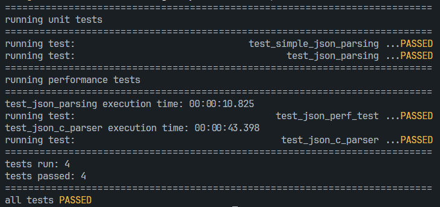

# simple JSON parser in C

A simple JSON parser in C

- lightning-fast implementation for a reasonable trade-offs, performance x4.009 comared to [json-c](https://github.com/json-c/json-c)

## docs

- [TOC](https://github.com/default-writer/c-json-parser/tree/main/docs)

## screenshots



## tools

Ninja + Clang

## prerequisites (json-c)

```bash
mkdir build
cd build
git clone https://github.com/json-c/json-c.git
cd json-c
cmake -DCMAKE_INSTALL_PREFIX=../../libs/
make all test install
```

## building

```bash
ninja -f build.linux.ninja && ./test-main
```

## testing

```bash
ninja -f build.linux.ninja -t clean > /dev/null 2>&1 && ninja -f build.linux.ninja && valgrind -s ./test-main
```

## profiling / performance tests (json-c)

```bash
ninja -f build.linux.ninja -t clean > /dev/null 2>&1 && ninja -f build.linux.ninja o2
ninja -f build.linux.ninja -t clean > /dev/null 2>&1 && ninja -f build.linux.ninja o3
ninja -f build.linux.ninja -t clean > /dev/null 2>&1 && ninja -f build.linux.ninja perf
```

## python

```bash
python3 test/perf_test.py
```
