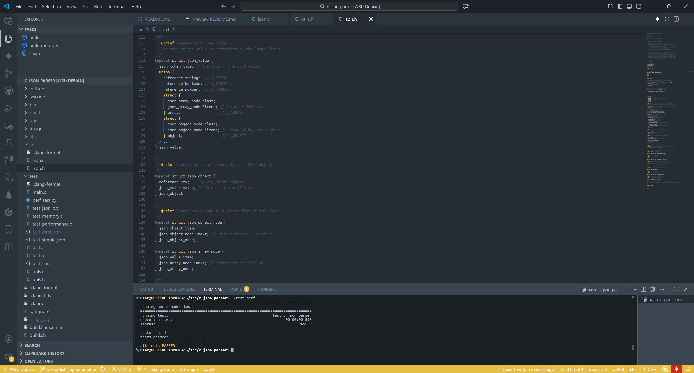

# [C JSON parser](https://github.com/default-writer/c-json-parser)

- lightning-fast implementation of a JSON parser
- added JSON validation
- easy to read, learn and implement
- c17 ready / c89 compatible

## performance

- significantly faster compared to [json-c](https://github.com/json-c/json-c)
- a little bit faster than [simdjson](https://github.com/simdjson/simdjson)
- supports [RFC 8259](https://datatracker.ietf.org/doc/html/rfc8259)
- supports SSE2

## [data](data/test.json)

- 2.8 nanoseconds (per run)
- 3846 bytes in a test data

## badges

[](https://github.com/default-writer/c-json-parser/actions/workflows/codeql.yml)

## Speed comparison

| Metric                                  |            simdjson |    c-json-parser(*) |       c-json-parser |       c-json-parser |              json-c |
| :---------------------------------------| ------------------: | ------------------: | ------------------: | ------------------: | ------------------: |
| execution time (100K run)               |        00:00:00.393 |        00:00:00.171 |        00:00:00.225 |        00:00:01.182 |        00:00:04.093 |
| execution time (1M runs)                |        00:00:03.959 |        00:00:00.891 |        00:00:00.895 |        00:00:11.838 |        00:00:42.702 |
| allocation calls (100K runs)            |                   - |                   0 |                   0 |          20,000,000 |          52,900,000 |
| allocation calls (1M runs)              |                   - |                   0 |                   0 |         200,000,000 |         529,000,000 |
| total heap usage (100K runs)            |                   - |                   0 |                   0 |         806,400,000 |       4,179,600,000 |
| total heap usage (1M runs)              |                   - |                   0 |                   0 |       8,064,000,000 |      41,796,000,000 |

(*) - version without string literal validation

## docs

- [basics](docs/data-structures.md)

## screenshots



## tools

Ninja + Clang

## prerequisites

```bash
sudo apt install -y git cmake clang clang gcc g++ lld
```

## build

```bash
./build-c-json-parser.sh
```

## profiling

```bash
./gprof.sh
```

## test

```bash
./test.sh
```

## runtime / performance

```bash
./perf.sh
./perf.sh perf-c-json-parser
./perf.sh perf-c-json-parser-long
./perf.sh perf-c-json-parser-no-string-validation
./perf.sh perf-c-json-parser-no-string-validation-long
```

## installation [simdjson](https://github.com/simdjson/simdjson) / [json-c](https://github.com/json-c/json-c)

```bash
./bin/install_json_c.sh
./bin/install_simdjson.sh
```

## build [simdjson](https://github.com/simdjson/simdjson) / [json-c](https://github.com/json-c/json-c)

```bash
./build-json-c.sh
./build-simdjson.sh 
```
