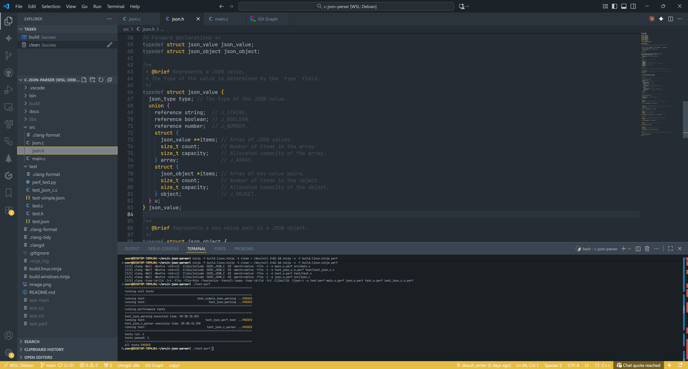
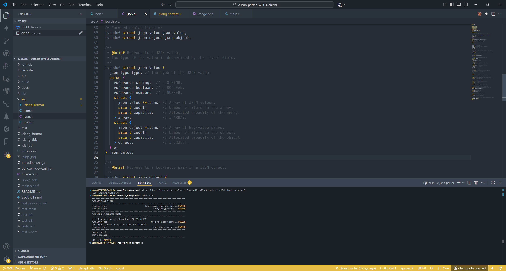

# C JSON parser

- lightning-fast implementation of a JSON parser
- performance improvement rate of x4/x10 for speed/memory compared to alternatives: [json-c](https://github.com/json-c/json-c)

## badges

[](https://github.com/default-writer/c-json-parser/actions/workflows/codeql.yml)

## comparison to json-c (min/100K runs)

| Metric                              | c-json-parser    | json-c          |
| :-----------------------------------| ---------------: | --------------: |
| execution time                      |     00:00:01.041 |    00:00:04.197 |
| allocation calls                    |        4,400,004 |      52,900,004 |
| total heap usage (bytes allocated)  |    1,292,809,439 |   4,179,609,439 |

## docs

- [data structures](https://github.com/default-writer/c-json-parser/blob/main/docs/json-data-structures.md)
- [documentation](https://github.com/default-writer/c-json-parser/tree/main/docs)

## screenshots


<!--  -->

## tools

Ninja + Clang

## prerequisites (json-c)

```bash
mkdir build
cd build
git clone https://github.com/json-c/json-c.git
cd json-c
cmake -DCMAKE_INSTALL_PREFIX=../../libs/ -DCMAKE_BUILD_TYPE=release
make all install
```

or just run (linux-based)

```bash
./bin/install_json_c.sh
```

## building

```bash
ninja -f build.linux.ninja && ./test-main
```

## testing

```bash
ninja -f build.linux.ninja -t clean > /dev/null 2>&1 && ninja -f build.linux.ninja
ninja -f build.linux.ninja -t clean > /dev/null 2>&1 && ninja -f build.linux.ninja o2
ninja -f build.linux.ninja -t clean > /dev/null 2>&1 && ninja -f build.linux.ninja o3
```

## profiling / performance tests (json-c)

```bash
ninja -f build.linux.ninja -t clean > /dev/null 2>&1 && ninja -f build.linux.ninja perf
ninja -f build.linux.ninja -t clean > /dev/null 2>&1 && ninja -f build.linux.ninja perf-json-c
```

## python

```bash
python3 test/perf_test.py
```
