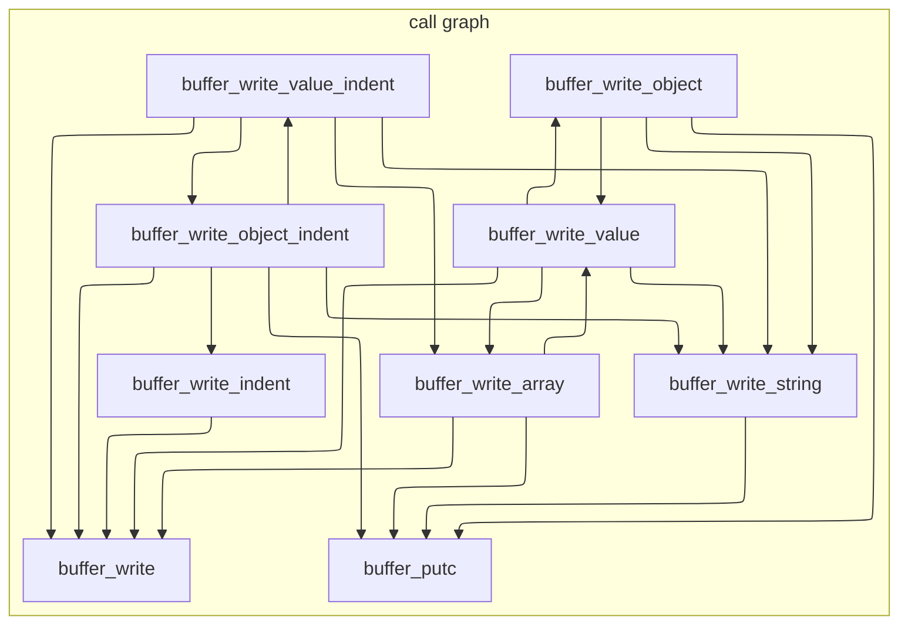

# call graph

```mermaid
---
id: 16d194c5-c817-4468-aea6-186cfdc590f8
config:
  layout: elk
---
flowchart TB
 subgraph StringifyLogic["call graph"]
    direction TB
        buffer_write_value_indent["buffer_write_value_indent"]
        buffer_write_indent["buffer_write_indent"]
        buffer_write_object_indent["buffer_write_object_indent"]
        buffer_write["buffer_write"]
        buffer_write_string["buffer_write_string"]
        buffer_write_array["buffer_write_array"]
        buffer_write_object["buffer_write_object"]
        buffer_write_value["buffer_write_value"]
        buffer_putc["buffer_putc"]
  end
    buffer_write_value_indent L_buffer_write_value_indent_buffer_write_0@--> buffer_write & buffer_write_string & buffer_write_array & buffer_write_object_indent
    buffer_write_value --> buffer_write & buffer_write_string & buffer_write_array & buffer_write_object
    buffer_write_object_indent --> buffer_write & buffer_write_indent & buffer_putc & buffer_write_string & buffer_write_value_indent
    buffer_write_object --> buffer_putc & buffer_write_value & buffer_write_string
    buffer_write_array --> buffer_write & buffer_putc & buffer_write_value
    buffer_write_string --> buffer_putc
    buffer_write_indent --> buffer_write


    L_buffer_write_value_indent_buffer_write_0@{ animation: none }
```
