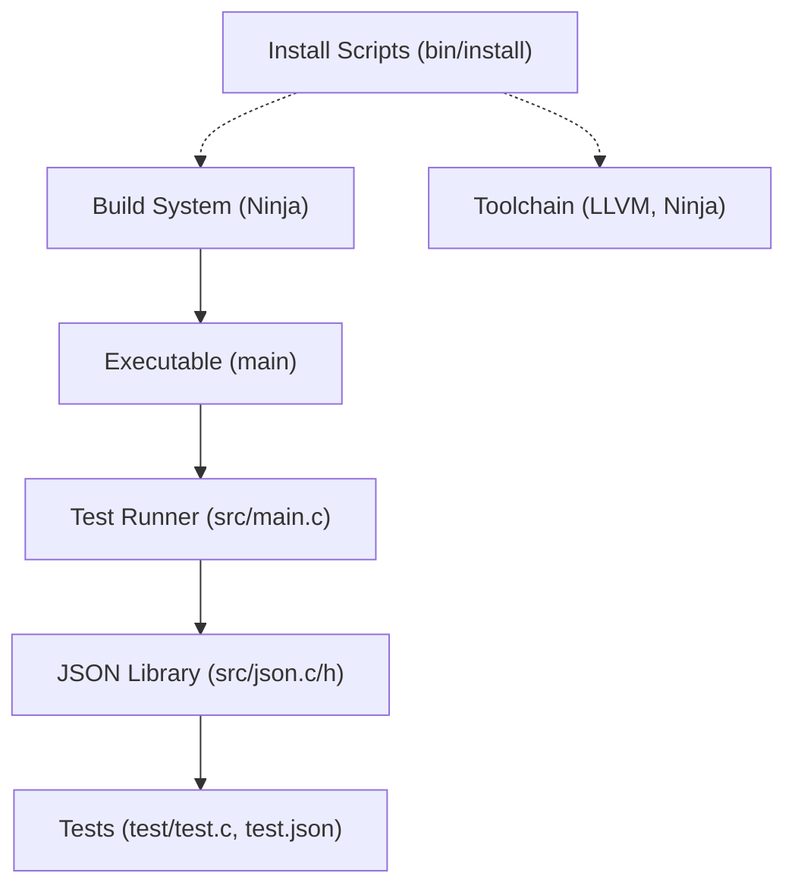
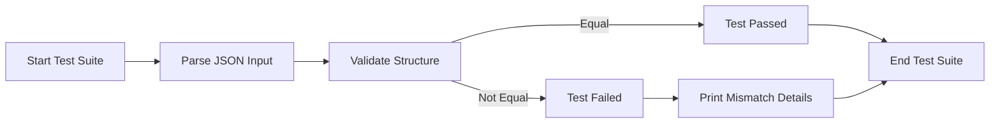

# Project Overview

## Project Purpose and Objectives

This project provides a lightweight and efficient C library for JSON processing, designed for easy embedding into C applications. It offers a comprehensive feature set for handling JSON data.

Key objectives include:

- Parsing: Convert JSON text into a structured, in-memory tree representation.
- Manipulation: Programmatically access and modify JSON objects and arrays.
- Comparison: Perform deep equality checks between JSON values for validation.
- Serialization: Convert the in-memory structure back into a formatted JSON string.
- Robustness: Ensure correctness and stability with a comprehensive test suite.

The core logic is implemented in `src/json.c` and `src/json.h`, with `src/main.c` driving the test suite.

## API Overview

- `json_parse()`:
  Converts a JSON string into an in-memory `json_value` tree.
- `json_object_get()`:
  Retrieves a value from a JSON object by key.
- `json_array_push()`:
  Appends an element to a JSON array.
- `json_object_set_take_key()`:
  Sets a key-value pair in a JSON object.
- `json_equal()`:
  Performs a deep comparison of two JSON values.
- `json_stringify()`:
  Converts a `json_value` tree back into a formatted JSON string.
- `json_free()`:
  Recursively frees an entire JSON tree and its associated memory.

## Stack and Technologies

- C Language (C11): Core implementation language chosen for performance, portability, and minimal dependencies.
- Clang/Clang-CL Compiler: Used for compiling source code on Linux and Windows. Selected for modern C standard support and tooling compatibility.
- Ninja Build System: Provides fast, reproducible builds with simple declarative syntax. Ninja is driven by generated build files from Makefile configurations.
- LLVM Toolchain (Version 21): Includes Clang compiler, linker (lld), and debugging tools (lldb-dap), essential for building and debugging on both Linux and Windows.
- PowerShell and Bash Scripts: Automate environment setup and toolchain installation tailored for Windows (`install.ps1`) and Linux (`install.sh`).
- ANSI Escape Codes: Used in test output for colored terminal feedback to improve developer experience.
- Standard C Libraries: For string manipulation, memory management, file I/O, and platform abstractions.

These technologies were chosen to ensure cross-platform build and development workflows, maximize performance, and maintain minimal external dependencies.

## High-Level Architecture

The architecture is modular and layered around core JSON processing logic, build automation, and testing framework:

- Core Library (`src/json.c` & `src/json.h`): Implements JSON parsing, serialization, and utilities.
- Application Entry (`src/main.c`): Runs test harness invoking JSON parsing and validation functions.
- Testing Suite (`test/test.c`, `test/test.h`, and JSON test files): Defines test cases that validate parser correctness with diverse JSON inputs.
- Build System (Ninja files): Platform-specific build instructions for compiling C source files and linking executables.
- Installation Scripts (`bin/install.sh` and `bin/install.ps1`): Automate environment setup and toolchain installation for Linux and Windows respectively.

Interactions:

- The frontend (test runner) invokes JSON parsing and manipulation APIs.
- The JSON core acts as the backend logic layer.
- Build files compile source into an executable.
- Installation scripts set up the development toolchain and environment.

## Developer Navigation

### Frontend Developers Start Here

- Explore `src/main.c` for program entry and test execution flow.
- Review `test/test.c` and `test/test.h` for test cases validating JSON parsing and equality.
- Use `test/test.json` and `test/test-simple.json` for test input examples.

### Backend Developers Focus On

- `src/json.c` and `src/json.h` to understand JSON parsing, printing, and manipulation logic.
- Study memory management and recursive parsing functions.
- Extend or optimize parsing states and value handling.

### Build and Toolchain Maintenance

- Modify `build.linux.ninja` and `build.windows.ninja` for build customization.
- Use `bin/install.sh` (Linux) or `bin/install.ps1` (Windows) to set up or update development environments.
- Troubleshoot build or toolchain issues through these scripts.

### Testing and Validation

- Add new test cases to `test/test.c` using the provided test macros.
- Create new JSON test files in the `test/` directory for edge cases.
- Use colored output for quick visual verification of test status.

---

## Further Reading

- [JSON Manipulation and Comparison](json-manipulation-and-comparison/README.md)
- [JSON Parsing and Representation](json-parsing-and-representation/README.md)
- [JSON Serialization and Testing](json-serialization-and-testing/README.md)
