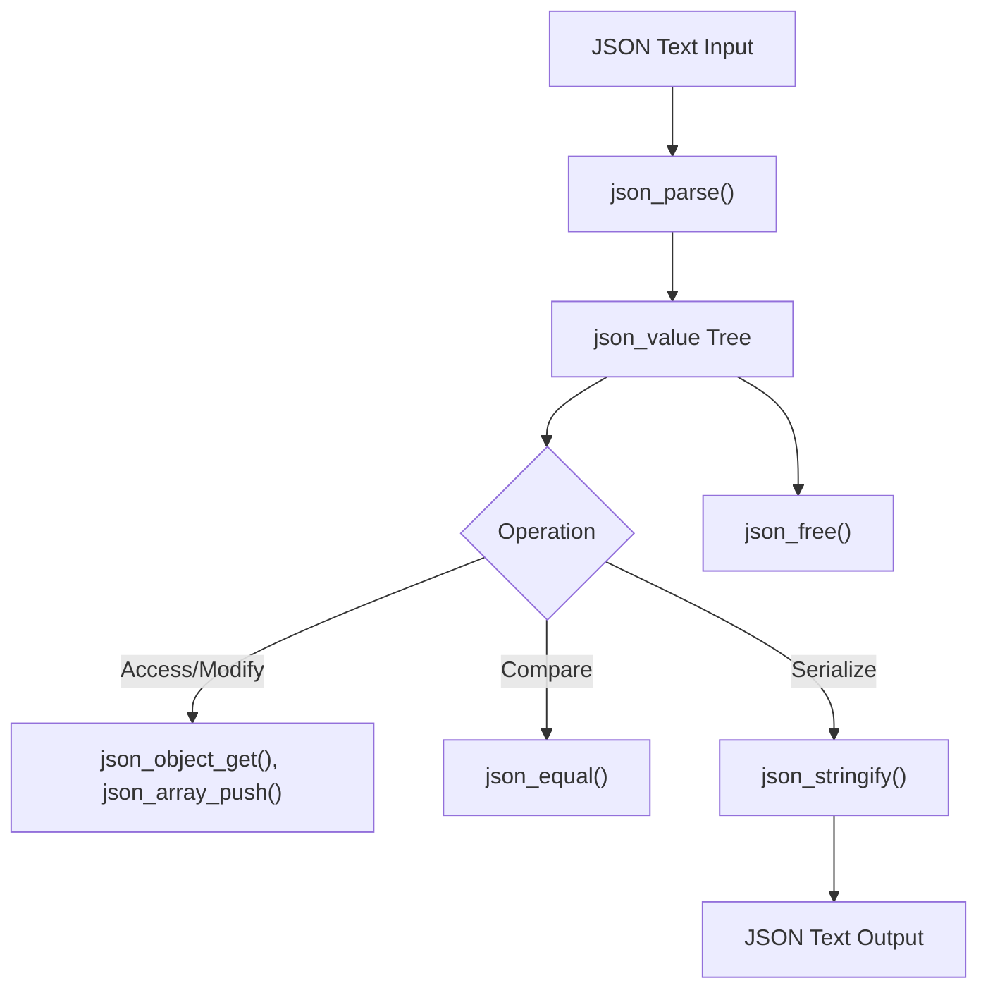
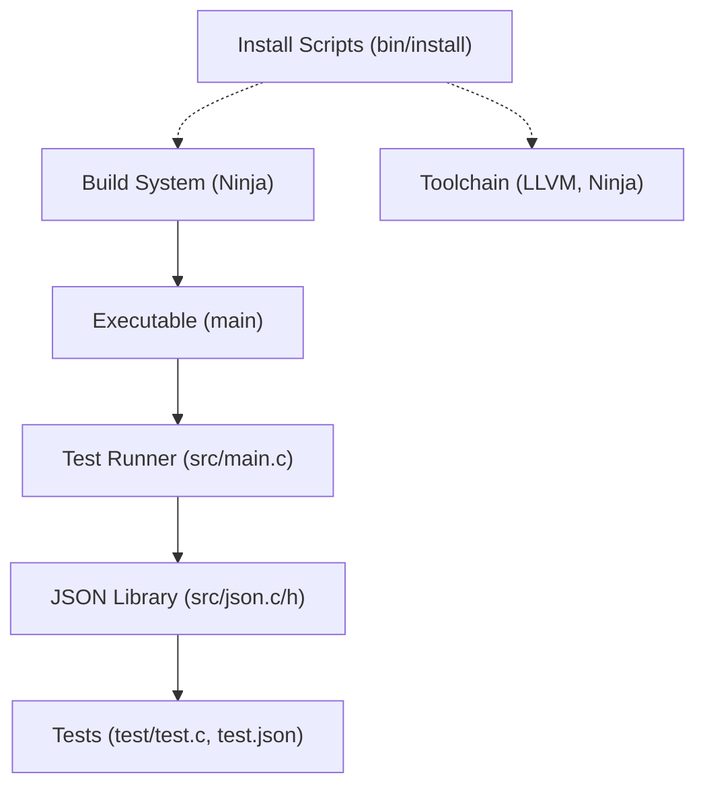
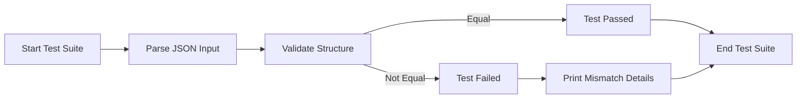

# Project Overview

## Project Purpose and Objectives

This project implements a robust C-language JSON processing library that provides parsing, manipulation, comparison, serialization, and printing of JSON data. The core objective is to offer a lightweight, efficient, and standards-compliant JSON parser and utility that can be embedded in C applications. The system focuses on:

- Parsing JSON text into a structured, in-memory representation supporting all JSON types: null, boolean, number, string, array, and object.
- Allowing safe and flexible manipulation of JSON data structures through an API.
- Providing deep equality comparison of JSON values for testing and validation.
- Enabling serialization of JSON values back into formatted JSON text with pretty-printing support.
- Offering utilities for efficient memory management and safe file I/O on multiple platforms.
- Supplying a test suite that validates parser correctness and robustness across a broad range of JSON inputs.

The major functionalities are implemented primarily in `src/json.c` and declared in `src/json.h`. The entry point in `src/main.c` initializes and runs JSON parsing tests defined in the `test` directory, ensuring correctness and stability.

## Example Workflows and Use Cases

### JSON Parsing and Querying

1. **Parsing JSON Text**  
   Developers can use `json_parse()` to convert a JSON string into an in-memory `json_value` tree. This function handles all JSON types and nested structures.

2. **Accessing JSON Data**  
   For objects, `json_object_get()` retrieves values by key. For arrays, direct indexing on the `json_value` array field can be performed.

3. **Manipulating JSON Values**  
   Use functions like `json_array_push()` to append elements to arrays or [json_object_set_take_key()](https://nextdocs.ai/github/default-writer/376/80073) to set key-value pairs in objects.

4. **Comparing JSON Structures**  
   `json_equal()` performs a deep comparison of two JSON value trees, useful for test assertions or synchronization checks.

5. **Serializing JSON**  
   `json_stringify()` converts a `json_value` tree back into a pretty-printed JSON string for storage or transmission.

6. **Memory Management**  
   After usage, `json_free()` releases all allocated memory related to the JSON value tree.

### Test Execution Workflow

- The `src/main.c` initializes the test environment using macros from `test/test.h`.
- It runs parsing and equality tests defined in `test/test.c` using the JSON files `test/test.json` and `test/test-simple.json` to cover complex and simple JSON cases.
- Tests output colored terminal results and detailed mismatch context on failure.

## Stack and Technologies

- **C Language (C11)**: Core implementation language chosen for performance, portability, and minimal dependencies.
- **Clang/Clang-CL Compiler**: Used for compiling source code on Linux and Windows. Selected for modern C standard support and tooling compatibility.
- **Ninja Build System**: Provides fast, reproducible builds with simple declarative syntax. Ninja is driven by generated build files from Makefile configurations.
- **LLVM Toolchain (Version 21)**: Includes Clang compiler, linker (lld), and debugging tools (lldb-dap), essential for building and debugging on both Linux and Windows.
- **PowerShell and Bash Scripts**: Automate environment setup and toolchain installation tailored for Windows (`install.ps1`) and Linux (`install.sh`).
- **ANSI Escape Codes**: Used in test output for colored terminal feedback to improve developer experience.
- **Standard C Libraries**: For string manipulation, memory management, file I/O, and platform abstractions.

These technologies were chosen to ensure cross-platform build and development workflows, maximize performance, and maintain minimal external dependencies.

## High-Level Architecture

The architecture is modular and layered around core JSON processing logic, build automation, and testing framework:

- **Core Library (`src/json.c` & `src/json.h`)**: Implements JSON parsing, serialization, and utilities.
- **Application Entry (`src/main.c`)**: Runs test harness invoking JSON parsing and validation functions.
- **Testing Suite (`test/test.c`, `test/test.h`, and JSON test files)**: Defines test cases that validate parser correctness with diverse JSON inputs.
- **Build System (Ninja files)**: Platform-specific build instructions for compiling C source files and linking executables.
- **Installation Scripts (`bin/install.sh` and `bin/install.ps1`)**: Automate environment setup and toolchain installation for Linux and Windows respectively.

Interactions:

- The frontend (test runner) invokes JSON parsing and manipulation APIs.
- The JSON core acts as the backend logic layer.
- Build files compile source into an executable.
- Installation scripts set up the development toolchain and environment.

## Developer Navigation

### Frontend Developers Start Here
- Explore `src/main.c` for program entry and test execution flow.
- Review `test/test.c` and `test/test.h` for test cases validating JSON parsing and equality.
- Use `test/test.json` and `test/test-simple.json` for test input examples.

### Backend Developers Focus On
- `src/json.c` and `src/json.h` to understand JSON parsing, printing, and manipulation logic.
- Study memory management and recursive parsing functions.
- Extend or optimize parsing states and value handling.

### Build and Toolchain Maintenance
- Modify `build.linux.ninja` and `build.windows.ninja` for build customization.
- Use `bin/install.sh` (Linux) or `bin/install.ps1` (Windows) to set up or update development environments.
- Troubleshoot build or toolchain issues through these scripts.

### Testing and Validation
- Add new test cases to `test/test.c` using the provided test macros.
- Create new JSON test files in the `test/` directory for edge cases.
- Use colored output for quick visual verification of test status.

---

