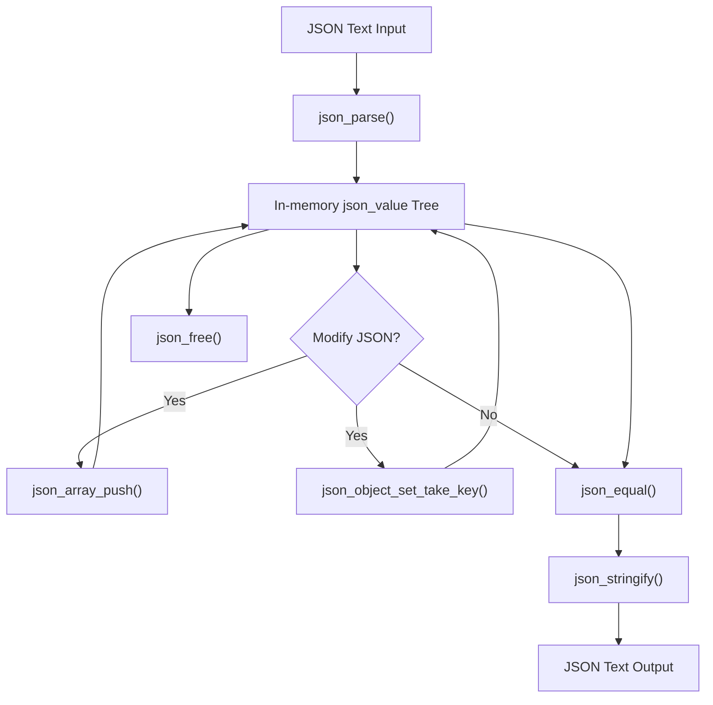

# JSON Manipulation and Comparison

## Overview

The JSON Manipulation and Comparison module provides a set of APIs and utilities designed to modify JSON data structures in-memory, perform deep equality checks for validation purposes, and manage memory safely during these operations. This module builds upon the foundational JSON parsing and representation layer by enabling dynamic updates to JSON arrays and objects and ensuring that JSON values can be reliably compared for structural equivalence.

Its core purpose is to allow client code to manipulate parsed JSON data flexibly and to verify JSON data integrity through deep comparison, all while handling memory allocation and deallocation responsibly to avoid leaks or corruption.

## Core Concepts and Functionality

### Modification of JSON Data Structures

JSON data in memory is represented as a tree of `json_value` objects, each with a type indicating whether it is a null, boolean, number, string, array, or object. This module includes functions that enable:

- **Adding elements to arrays:**  
  The internal function `json_array_push()` allows appending new JSON values to an existing array, automatically resizing the underlying storage if needed.

- **Setting or replacing object key-value pairs:**  
  The internal function `json_object_set_take_key()` inserts or replaces a key-value pair within a JSON object. It searches for an existing key and replaces its value if found; otherwise, it adds a new entry. The implementation manages dynamic resizing of the object's internal storage and carefully handles ownership of the key and value pointers to avoid memory leaks.

The module employs dynamic arrays internally to store elements of JSON arrays and key-value pairs for JSON objects, with growth strategies that double the capacity when limits are reached, ensuring efficient memory use and amortized constant-time insertions.

### Deep Equality Checks

To validate whether two `json_value` trees represent equivalent JSON data, the module provides a deep equality function, similar to `json_equal()`. This function performs a recursive comparison that:

- Verifies type equality for the two values.
- For primitive types (null, boolean, number, string), compares the content by string length and character data.
- For arrays, recursively compares each element in order, ensuring the same length and content.
- For objects, compares that both have the same number of key-value pairs and that each key in one object exists in the other with an equal corresponding value. Key order is not assumed to be the same, so lookup is performed for each key.

This thorough comparison ensures that two JSON structures are equal in both shape and content, which is essential for testing, caching, synchronization, and data validation scenarios.

### Memory Management

The module includes careful memory management routines that:

- Allocate new `json_value` objects on the heap when creating or modifying JSON data.
- Free all allocated memory associated with a `json_value` and its children recursively using functions like `json_free()` and internal helpers.
- Handle ownership transfer correctly, especially when inserting or replacing values in objects to prevent double frees or leaks.

This approach guarantees safe and predictable memory behavior during JSON manipulations.

## Interaction with Other Components

The module depends on the JSON parsing and representation functionality (`JSON Parsing and Representation`) for creating the initial in-memory `json_value` trees. Once parsed, the manipulation functions operate on these trees to add, modify, or remove elements.

Similarly, serialization and printing functions from the `JSON Serialization and Testing` topic consume the modified JSON structures produced by this module to generate formatted JSON output.

The deep equality checks integrate closely with testing workflows to assert correctness of parsing, manipulation, or serialization by comparing expected and actual JSON trees.

## Key Workflows and API Usage

### Modifying JSON Objects and Arrays

- **Add to array:**  
  To append an item to a JSON array, the array's internal dynamic list is resized if necessary, and the new item is copied into the array's items. For example:

  ```c
  // Internal function
  json_array_push(my_array, new_item);
  ```

  This ensures `my_array` contains the newly appended value.

- **Set object key-value:**  
  To set or replace a key-value pair in a JSON object:

  ```c
  json_object_set_take_key(my_object, key_ptr, key_len, value);
  ```

  This searches for `key_ptr` in the object keys and replaces the associated value if found; otherwise, it adds a new key-value pair, expanding capacity as needed.

### Comparing JSON Values

To check if two JSON `json_value` trees are structurally equal:

```c
bool are_equal = json_equal(value1, value2);
```

This performs recursive comparison based on type and content, including nested arrays and objects.

### Memory Handling

When JSON values are no longer needed:

```c
json_free(value);
```

This frees the entire JSON subtree rooted at `value`, including all nested arrays and objects.

## Internal Design Patterns and Concepts

- **Dynamic Array Growth:**  
  Both arrays and objects use internal capacity fields and double their allocated size whenever the current storage is exhausted. This pattern balances memory allocation overhead with efficient insertions.

- **String References:**  
  Instead of duplicating string data for keys, numbers, or booleans, the module stores pointers (`reference`) into the original parsed JSON string, avoiding extra allocations. This requires careful lifetime management to ensure the source string remains valid during manipulation.

- **Recursive Operations:**  
  Both freeing and equality checking are implemented recursively, traversing the JSON tree structure in depth-first order.

- **Ownership Transfer:**  
  The `json_object_set_take_key()` function is designed to take ownership of the `value` pointer passed to it, meaning the caller relinquishes responsibility for freeing that value after insertion. This helps prevent memory leaks and double frees.

## Visualization of JSON Manipulation and Comparison Workflow



This diagram illustrates the flow from JSON text input through parsing, optional modification using array push or object set operations, deep equality comparison, serialization back to text, and finally memory cleanup.

## References

- For foundational parsing and representation details, see [JSON Parsing and Representation](None).
- For output formatting and testing of JSON, refer to [JSON Serialization and Testing](None).
- For details on modifying JSON data structures and comparing them, see the subtopics [JSON Data Modification](/JSON Data Modification) and [Deep Equality Checks](/Deep Equality Checks).
