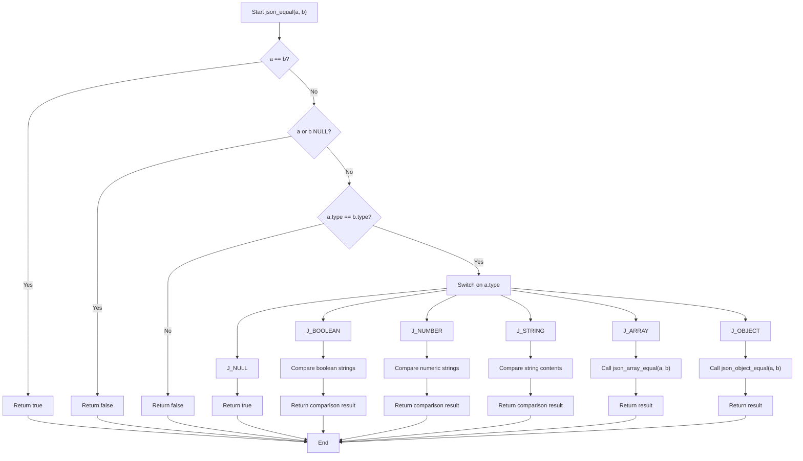

# Deep Equality Checks

## Purpose

Within the broader scope of [JSON Manipulation and Comparison](80082), the subtopic *Deep Equality Checks* addresses the need to verify whether two JSON data structures are semantically identical. This capability is crucial for testing JSON parsers, validating synchronization states between JSON documents, and ensuring the integrity of JSON transformations. Unlike shallow comparisons that might only check references or surface-level data, deep equality recursively inspects every element and property, confirming that two JSON trees represent the same data regardless of memory layout or object ordering.

## Functionality

Deep equality comparison operates by recursively traversing two JSON value trees and comparing their contents according to JSON semantics:

- **Primitive Types**:  
  For `null`, `boolean`, `number`, and `string` types, equality is determined by content equivalence. For instance, two boolean values are equal if their textual representations match exactly (e.g., `"true"` vs. `"true"`). Numeric equality is string-based but could be extended to numeric equivalence. String equality compares length and character sequences.

- **Arrays**:  
  Two arrays are equal if they have the same length and each corresponding element is deeply equal. The order of elements is significant.

- **Objects**:  
  Two JSON objects are equal if they have the same number of key-value pairs and each key in one object exists in the other with a deeply equal value. The order of keys is not significant; keys are matched by string content.

The core function implementing this logic is `json_equal()`, which performs type checks and delegates to specialized helpers for arrays (`json_array_equal()`) and objects ([json_object_equal()](/projects/376/80073)).

### Key Workflows

1. **Type Matching**  
   Immediately returns false if types differ, or true if both pointers reference the same object.

2. **Primitive Comparison**  
   Uses string comparison (`strncmp`) for booleans, numbers, and strings to validate equality.

3. **Array Comparison**  
   Recursively calls `json_equal()` on each pair of corresponding elements.

4. **Object Comparison**  
   For each key-value pair in the first object, searches for the same key in the second object using `json_object_get()`. If found, recursively compares the values.

### Code Snippet Illustrating Core Logic

```c
bool json_equal(const json_value *a, const json_value *b) {
  if (a == b)
    return true;
  if (!a || !b)
    return false;
  if (a->type != b->type)
    return false;
  switch (a->type) {
  case J_NULL:
    return true;
  case J_BOOLEAN:
    return a->u.boolean.len == b->u.boolean.len && strncmp(a->u.boolean.ptr, b->u.boolean.ptr, a->u.boolean.len) == 0;
  case J_NUMBER: {
    return a->u.number.len == b->u.number.len && strncmp(a->u.number.ptr, b->u.number.ptr, a->u.number.len) == 0;
  }
  case J_STRING:
    if (a->u.string.ptr == NULL && b->u.string.ptr == NULL)
      return true;
    if (a->u.string.ptr == NULL || b->u.string.ptr == NULL)
      return false;
    if (a->u.string.len != b->u.string.len)
      return false;
    return strncmp(a->u.string.ptr, b->u.string.ptr, a->u.string.len) == 0;
  case J_ARRAY:
    return json_array_equal(a, b);
  case J_OBJECT:
    return json_object_equal(a, b);
  default:
    return false;
  }
}
```

This recursive approach ensures complete semantic equivalence of JSON data.

## Integration

*Deep Equality Checks* supplements the [JSON Data Modification](/80082) subtopic by providing validation after modifications to verify the intended effects. For example, after using APIs to update objects or arrays, `json_equal()` can confirm that the modified structure matches an expected JSON value.

It also plays a critical role in the overarching testing framework described in [JSON Serialization and Testing](80083), where JSON outputs from parsing and serialization steps are compared against known reference values to assert correctness.

Memory management functions in the parent topic ensure that no leaks or dangling pointers occur during or after equality checks, especially when temporary JSON values are created for comparison purposes.

The `json_object_get()` helper function from the parent topic facilitates efficient key lookups during object comparisons, while `json_array_equal()` ensures element-wise array validation.

## Diagram



This flowchart summarizes the decision-making process within the deep equality comparison, illustrating the recursive and type-dependent nature of the checks.
