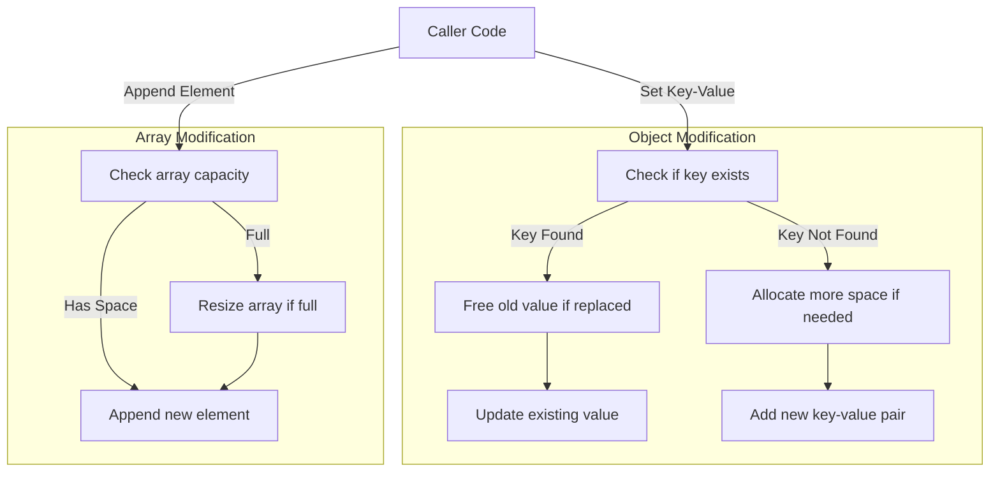

# JSON Data Modification

## Purpose

Within the broader scope of JSON manipulation and comparison, the subtopic *JSON Data Modification* addresses the need for dynamic and flexible changes to JSON data structures after parsing. While the parent topic covers overall modification capabilities and deep equality checks, this subtopic specifically focuses on the foundational functions that enable adding, retrieving, and setting key-value pairs in JSON objects, as well as managing elements within JSON arrays. It provides the mechanisms to mutate JSON trees safely and efficiently, supporting operations such as inserting new entries, updating existing ones, or appending array elements dynamically.

This functionality is essential for use cases where JSON data must be programmatically altered, such as updating configuration values, augmenting data structures before serialization, or constructing JSON responses incrementally. By enabling direct modification of the in-memory JSON representation, this subtopic empowers developers to manipulate JSON without re-parsing or reconstructing entire documents.

## Functionality

The key workflows supported by *JSON Data Modification* include:

- Adding or Updating Object Properties  
  The function [json_object_set_take_key()](../../src/json.c) inserts a new key-value pair into a JSON object or updates the value if the key already exists. It operates by searching the object's internal key array and replacing the value if found, otherwise expanding the capacity of the key-value array if needed, and appending the new entry. This function takes ownership of the key's string pointer to avoid unnecessary duplication.

- Retrieving Object Properties by Key  
  The function [json_object_get()](../../src/json.c) returns a pointer to the JSON value associated with a given key in an object, or NULL if the key does not exist. This provides read-access to dynamic properties within JSON objects.

- Appending Elements to Arrays  
  The function [json_array_push()](../../src/json.c) adds a new element to the end of a JSON array, resizing the internal array storage if required. It ensures the array can grow dynamically as elements are added.

- Creating New JSON Values for Arrays and Objects  
  Functions like [json_new_object()](../../src/json.c) and [json_new_array()](../../src/json.c) allocate and initialize empty JSON object and array structures to serve as containers for further modifications.

- Memory Management During Modification  
  When replacing values in objects, the old JSON value is freed properly to avoid memory leaks, ensuring safe mutation of the JSON tree.

These operations form the fundamental building blocks for JSON structure mutation, supporting both small incremental changes and complex restructuring.

### Example Interaction Snippet

```c
reference ref = {*s, 0};

/* Take ownership of the parsed key buffer (no extra duplication). */
if (!json_object_set_take_key(obj, ref.ptr, ref.len, val)) {
  /* insertion failed: free transferred resources */
  free_json_value_contents(val);
  free_json_value_contents(obj);
  return NULL;
}
// Retrieve a value by key from an object
json_value *val = json_object_get(obj, key_ptr, key_len);

// Append a value to an array
json_array_push(arr, element);
```

## Diagram



This flowchart depicts how the modification functions handle adding or updating object keys and appending elements to arrays, including capacity checks and memory management.


## Further Reading

- [JSON Manipulation and Comparison](README.md)
- [JSON Serialization and Testing](../json-serialization-and-testing/README.md)
- [JSON Parsing and Representation](../json-parsing-and-representation/README.md)
