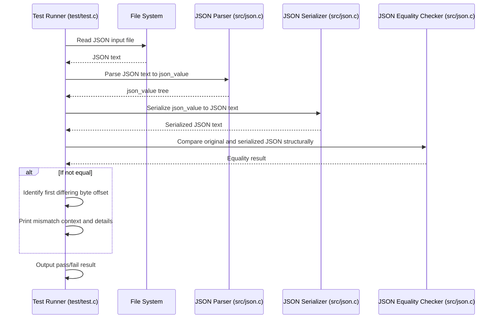

# JSON Serialization and Testing

## Overview

The **JSON Serialization and Testing** module provides two essential capabilities within the project:

1. **JSON Serialization**: Converting in-memory JSON data structures back into human-readable, pretty-printed JSON text.
2. **Automated Test Suite**: A comprehensive set of tests that validate the correctness and robustness of the JSON parser and serializer.

This module ensures that JSON data parsed into the internal representation can be reliably and accurately serialized back, preserving structure and formatting conventions. Concurrently, it verifies through automated testing that parsing, equality checks, and serialization maintain fidelity and handle edge cases gracefully.

---

## Pretty-Printing JSON

### Purpose and Design

After JSON text is parsed into the project’s internal structured representation (`json_value` trees), it is often necessary to serialize this structure back into formatted JSON text. The serialization component focuses on producing **pretty-printed** JSON output that is both compact and readable.

Key goals include:

- Producing well-indented, human-friendly JSON, especially for objects.
- Printing arrays in a compact, single-line format to improve readability where suitable.
- Correctly escaping strings and maintaining JSON syntax validity.
- Efficiently handling all JSON value types (null, boolean, number, string, array, object).

### Core Concepts and Structure

The serialization logic is implemented primarily in `src/json.c` with corresponding declarations in [src/json.h](/projects/376/80073). It operates on the internal `json_value` structure, which represents JSON values recursively.

Key functions include:

- **`json_stringify()`**  
  The main public API function that converts a `json_value` tree into a newly allocated pretty-printed JSON string. It internally uses a buffer-based printer to build the output string.

- **`print_value()` and `print_value_buf()`**  
  Recursive functions that dispatch printing based on JSON type and manage indentation and formatting.

- **String Escaping**  
  Functions like `print_string_escaped()` ensure that special characters in strings are escaped properly (e.g., quotes, backslashes, Unicode sequences).

- **Array and Object Formatting**  
  - Arrays are printed compactly in a single line by `print_array_compact()` and related buffer functions.  
  - Objects are printed with indentation and line breaks for each key-value pair by `print_object_buf()`, improving readability for nested structures.

- **Buffer Management**  
  A small buffer state (`bs`) manages writing characters efficiently into a fixed-size buffer, with careful overflow checks.

The pretty-printing approach emphasizes a natural layout: objects are indented and multi-line, arrays stay compact unless nested within objects. This strikes a balance between readability and concise output.

### Interaction with Parsing and Representation

This module depends on the structured JSON representation produced by the parsing subsystem (covered by the `[JSON Parsing and Representation](None)` topic). After parsing, the `json_value` tree is passed to serialization functions to produce textual output.

The serializers use the stored string pointers (`reference`) within `json_value` nodes to print JSON primitives without duplicating data unnecessarily.

### Example Usage

```c
const json_value *root = json_parse(json_text);
if (root) {
  char *pretty_json = json_stringify(root);
  if (pretty_json) {
    printf("%s\n", pretty_json);
    free(pretty_json);
  }
  json_free(root);
}
```

This snippet parses JSON text, serializes it back to pretty-printed JSON, and cleans up resources.

---

## Automated Test Suite

### Purpose and Scope

The automated test suite ensures the overall correctness and robustness of the JSON parsing, serialization, and equality checking components. It validates that:

- JSON inputs from various test files are parsed into structured objects correctly.
- Serializing those objects back to JSON text produces semantically equivalent JSON.
- The parser handles diverse JSON types, edge cases, and complex nested structures without error.
- Structural equality comparisons correctly identify matching JSON data regardless of formatting differences.

### Structure and Components

The test suite is implemented mainly in the `test` directory:

- **`test/test.c`**  
  Defines multiple test cases that:
  - Load JSON input files (`test-simple.json`, `test.json`).
  - Parse the content using `json_parse()`.
  - Serialize the parsed structure back to JSON text using `json_stringify()`.
  - Compare the original and serialized JSON using deep structural equality (`json_equal()` via a wrapper function).
  - Report detailed mismatch information on failure, including differing byte offsets and context snippets.

- **`test/test.h`**  
  Provides macros and functions to manage test lifecycle, output colored terminal results, and assert conditions.

- **`test/test-simple.json` and `test/test.json`**  
  Contain JSON data of increasing complexity, ranging from simple arrays to large, nested objects with diverse value types.

### Key Testing Workflow

1. **Initialization**  
   `test_initialize()` sets up terminal coloring and other test environment details.

2. **Test Execution**  
   Each test:
   - Reads JSON text from a file.
   - Parses it to an internal `json_value` tree.
   - Serializes the tree back to JSON text.
   - Compares the original and serialized JSON structurally.

3. **Validation and Reporting**  
   - Uses `json_equal()` to verify structural equality.
   - On failure, identifies the first differing byte offset and prints surrounding context to aid debugging.
   - Prints pass/fail results with color coding.

4. **Integration with Main**  
   The `src/main.c` file calls the test functions to run the suite automatically when the program executes.

### Automation Benefits

- Ensures regressions are caught early.
- Validates that serialization preserves JSON semantics.
- Tests handle a wide range of real-world scenarios and corner cases.
- Facilitates continuous integration and quality assurance.

---

## Interaction Diagram of Serialization and Testing Processes



---

## Interactions and Dependencies

- **With Parsing and Representation**:  
  Serialization relies on the structured JSON tree created by the parsing subsystem. The test suite depends on both parsing and serialization to verify correctness end-to-end.

- **With Memory Management**:  
  The module carefully manages allocation and deallocation of buffers and `json_value` structures, ensuring no leaks during repeated serialization and testing.

- **With Output and Logging**:  
  The test suite uses formatted console output with ANSI color codes for clear pass/fail visualization, adapting to platform capabilities.

---

## Important Concepts and Patterns

- **Reference-Based String Storage**  
  JSON strings, numbers, and booleans are stored as references to the original input buffer to avoid unnecessary copying, enabling efficient serialization.

- **Recursive Serialization**  
  The serialization functions recursively traverse the `json_value` tree, formatting nested arrays and objects according to their types.

- **Buffer State Abstraction**  
  The `bs` structure abstracts buffer writing with capacity and position tracking, supporting both file and memory buffer outputs.

- **Test Macros for Consistency**  
  The test suite leverages custom macros to standardize test definitions, assertions, and result reporting, improving maintainability.

- **Contextual Mismatch Reporting**  
  When tests fail, the suite pinpoints the first byte discrepancy and prints surrounding characters, helping identify subtle parsing or serialization bugs.

---

The above details capture the essence and architecture of the **JSON Serialization and Testing** module, illustrating how it ensures JSON data integrity through reliable serialization and rigorous automated validation. For further understanding of the JSON data structures and parsing mechanisms, refer to the `[JSON Parsing and Representation](None)` topic.
