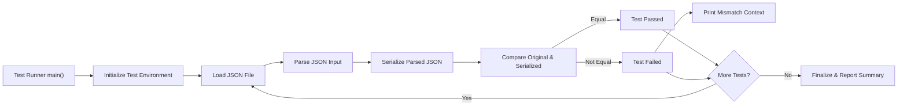

# Automated Test Suite

## Purpose

The Automated Test Suite addresses the need for rigorous validation of JSON parsing, structural integrity, and serialization within the broader scope of the [JSON Serialization and Testing](https://nextdocs.ai/github/default-writer/c-json-parser/80083) topic. While the parent topic outlines capabilities to serialize JSON and ensure parser correctness, this subtopic focuses specifically on the systematic verification of those capabilities through automated tests. It ensures that the JSON processing library correctly interprets diverse JSON input formats, maintains structural equality, and produces consistent, pretty-printed output. Additionally, the suite enhances developer experience by providing clear, colored terminal feedback indicating pass/fail status and detailed mismatch context when tests fail.

## Functionality

The Automated Test Suite operates by executing defined test cases that:

1. **Load JSON Inputs:** Reads JSON text files containing a variety of test cases, from simple arrays to complex nested objects with multiple data types.

2. **Parse JSON Data:** Uses the core parsing function (`json_parse()`) to convert input JSON strings into the internal `json_value` tree representation, as defined in [JSON Parsing and Representation](https://nextdocs.ai/github/default-writer/c-json-parser/80084).

3. **Serialize Parsed Data:** Converts the in-memory JSON structure back into formatted JSON text using the serialization function (`json_stringify()`), aligning with the pretty-printing utilities under [Pretty-Printing JSON](/80083).

4. **Compare Structures:** Validates that the original JSON input and the serialized output represent the same JSON structure, regardless of formatting or key order. This structural equality check uses the deep comparison function (`json_equal()`), part of the [JSON Manipulation and Comparison](https://nextdocs.ai/github/default-writer/c-json-parser/80082) topic.

5. **Report Results:** Provides colored terminal feedback using ANSI escape codes to indicate success (green) or failure (red). On failure, it outputs the precise location and textual context of the mismatch to aid debugging.

6. **Test Macros and Assertions:** Employs a lightweight testing framework with macros to manage test setup, execution, assertions, and teardown. This framework automatically tracks the number of tests run and passed.

### Key Workflow Steps

- **Initialization:** The suite enables ANSI color support on Windows consoles and sets up global variables for colored output.

- **Test Execution:** Each test function reads a JSON file, parses it, serializes the parsed structure back to text, then asserts structural equality.

- **Error Diagnostics:** If structural equality fails, the suite locates the first differing byte in the inputs and prints surrounding context with offsets.

- **Test Harness:** The `main()` function in `src/main.c` initializes the environment, runs all test cases, and finalizes with a summary.

### Code Snippet: Structural Equality Check and Diagnostic

```c
static bool test_json_equal(const char *a, const char *b) {
  if (!a || !b)
    return false;

  const char *pa = a;
  const char *pb = b;

  if (!a && !b) {
    return false;
  }

  skip_ws(&pa);
  skip_ws(&pb);

  json_pool_reset();
  json_value *va = json_parse(pa);
  json_value *vb = json_parse(pb);

  if (!va || !vb) {
    return false;
  }

  if (va->type != vb->type) {
    json_free(va);
    json_free(vb);
    return false;
  }

  bool eq = json_equal(va, vb);

  if (!eq) {
    /* find first differing position in the original inputs (skip whitespace) */
    const char *xa = pa;
    const char *xb = pb;
    while (*xa || *xb) {
      while (isspace((unsigned char)*xa))
        xa++;
      while (isspace((unsigned char)*xb))
        xb++;
      if (*xa != *xb)
        break;
      xa++;
      xb++;
    }
    size_t off_a = (size_t)(xa - pa);
    size_t off_b = (size_t)(xb - pb);
    /* print brief context */
    size_t ctx_before = PREFIX_CHAR_OFFSET;
    size_t ctx_after = POSTFIX_CHAR_OFFSET;
    size_t start_a = (off_a > ctx_before) ? off_a - ctx_before : 0;
    size_t start_b = (off_b > ctx_before) ? off_b - ctx_before : 0;
    fprintf(stderr, "JSON mismatch: first differing byte offsets a=%zu b=%zu\n", off_a, off_b);
    fprintf(stderr, "a context: \"");
    for (size_t i = start_a; i < off_a + ctx_after && pa[i] != '\0'; ++i) {
      char c = pa[i];
      fputc(c, stderr);
    }
    fprintf(stderr, "\"\n");
    fprintf(stderr, "b context: \"");
    for (size_t i = start_b; i < off_b + ctx_after && pb[i] != '\0'; ++i) {
      char c = pb[i];
      fputc(c, stderr);
    }
    fprintf(stderr, "\"\n");
  }

  json_free((json_value *)va);
  json_free((json_value *)vb);
  return eq;
}
```

This function underpins the validation by combining parsing, deep comparison, and detailed error reporting.

### Test Macros Example

The macros defined in `test/test.h` simplify writing test cases:

```c
TEST(test_simple_json_parsing) {
  // Setup and run test logic
  ASSERT(test_json_equal(original_json, serialized_json));
  END_TEST;
}
```

They manage counting tests, reporting status, and handling assertions with minimal boilerplate.

## Integration

The Automated Test Suite is tightly integrated with the core JSON processing components and other subtopics:

- **[JSON Parsing and Representation](https://nextdocs.ai/github/default-writer/c-json-parser/80084):** Invokes `json_parse()` to build the internal JSON tree from input text.

- **[Pretty-Printing JSON](https://nextdocs.ai/github/default-writer/c-json-parser/80086) subtopic:** Uses `json_stringify()` to serialize the JSON tree back to formatted text, testing the serialization fidelity.

- **[JSON Manipulation and Comparison](https://nextdocs.ai/github/default-writer/c-json-parser/80082):** Employs `json_equal()` for deep equality checks to confirm structural consistency between original and serialized JSON.

- **[JSON Serialization and Testing](https://nextdocs.ai/github/default-writer/c-json-parser/80083):** Implements the testing portion that verifies the serialization and overall parser correctness, fulfilling the parent topic's promise of a comprehensive test suite.

- **Build and Execution:** The `src/main.c` file serves as the test runner, invoking all test cases and managing initialization and finalization phases.

This integration ensures that the Automated Test Suite exercises the full JSON processing pipeline and verifies cross-functional correctness.



This flowchart illustrates the core process of each test cycle, from loading input to reporting results, highlighting how structural equality verification is central to the suite.
