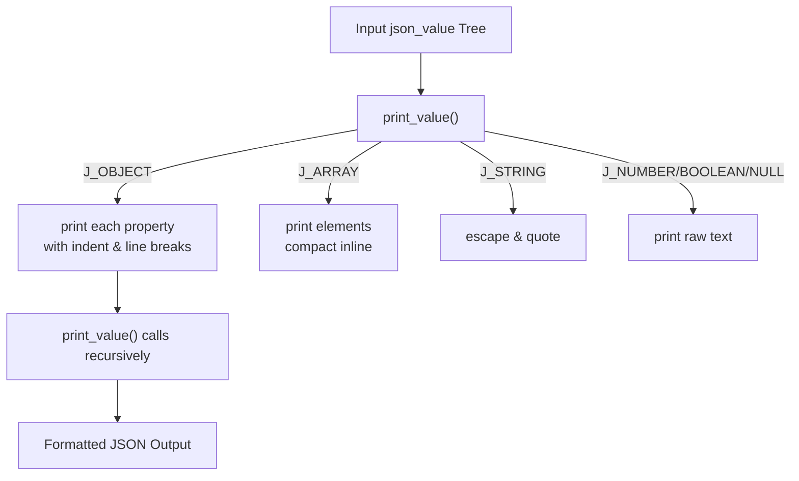

# Pretty-Printing JSON

## Purpose

The **Pretty-Printing JSON** subtopic addresses the need to convert in-memory JSON structures into readable, well-formatted JSON text. While the parent topic [JSON Serialization and Testing](80083) covers the broader capability of serializing JSON data and verifying parser correctness, this subtopic focuses specifically on formatting output with indentation, line breaks, and proper escaping. This enhances human readability for debugging, logging, or configuration files, where compact representations are insufficient.

## Functionality

This subtopic provides a suite of functions designed to traverse the `json_value` tree and produce formatted JSON output supporting:

- **Indentation:** Nested objects are indented with four spaces per level, improving visual hierarchy.
- **Escaped Characters:** String values are wrapped in quotes and escape sequences are preserved to ensure valid JSON output.
- **Compact Arrays:** Arrays are printed on a single line to maintain concise yet readable output.
- **Line Breaks:** Objects use line breaks between properties, with commas and colons spaced per JSON conventions.
- **Buffer and File Output:** Supports printing directly to `FILE*` streams or into buffers for flexible usage.

The core printing logic is implemented via recursive functions that pattern-match on the JSON value type and call appropriate pretty-print helpers. For example:

- `print_value()` prints any `json_value` with indentation and formatting.
- `print_string_escaped()` handles strings by wrapping with quotes and escaping characters.
- `print_array_compact()` prints arrays inline, separated by commas and spaces.
- `print_object_buf()` recursively prints objects with line breaks and indentation.

These functions work together to generate a clean, human-friendly JSON serialization that respects JSON syntax rules and maintains fidelity to the original data.

### Key workflows

- **Recursion over JSON Values:** The pretty-printer recursively walks the JSON tree. For objects, it prints each key-value pair on its own indented line; for arrays, it prints all elements on a single line.
- **Indentation Management:** Indentation level is passed down recursively and rendered as four spaces per level, aligned with JSON nesting.
- **Escaping Strings:** When printing strings, special characters and escape sequences are carefully handled to ensure output remains valid JSON and readable.
- **Buffer Writing:** The subtopic includes a buffered printing variant that writes formatted JSON into a fixed-size memory buffer, used by `json_stringify()` to return pretty-printed strings.

### Illustrative snippet

```c
static void print_value(const json_value *v, int indent, FILE *out) {
  if (!v) {
    fputs("null", out);
    return;
  }
  switch (v->type) {
  case J_NULL:
    fputs("null", out);
    break;
  case J_STRING:
    print_string_escaped(out, v->u.string.ptr, v->u.string.len);
    break;
  case J_ARRAY:
    print_array_compact(v, out);
    break;
  case J_OBJECT:
    fputs("{\n", out);
    for (size_t i = 0; i < v->u.object.count; ++i) {
      if (i) fputs(",\n", out);
      print_indent(out, indent + 1);
      json_object *e = &v->u.object.items[i];
      print_string_escaped(out, e->ptr, e->len);
      fputs(": ", out);
      print_value(e->value, indent + 1, out);
    }
    fputc('\n', out);
    print_indent(out, indent);
    fputc('}', out);
    break;
  default:
    // Other types handled similarly
    break;
  }
}
```

This function clearly illustrates the recursive structure, indentation, and formatting logic central to pretty-printing.

## Integration

The pretty-printing functionality is a crucial component of the parent topic [JSON Serialization and Testing](80083). It complements the parsing capabilities from [JSON Parsing and Representation](80084) by enabling the reverse operation: transforming parsed in-memory JSON values back into human-readable text.

- The `json_stringify()` API exposed by this subtopic is used to serialize the entire `json_value` tree with pretty-printing, returning a formatted string buffer.
- The `json_print()` function allows direct printing to standard output or file streams, useful for debugging or logging.
- It integrates with the test suite discussed in the [Automated Test Suite](/80083), which validates that the serialization output matches expected pretty-printed JSON formats, ensuring parser and printer correctness.
- The recursive pretty-print logic relies on the structural representation of JSON values managed and manipulated via [JSON Manipulation and Comparison](80082).

Thus, pretty-printing acts as the presentation layer that translates the structured JSON data back into a clean textual form, bridging in-memory representation and external representation.

## Diagram



This flowchart illustrates the recursive dispatch mechanism: `print_value()` inspects the JSON type and delegates to specialized print functions, with objects causing nested recursive calls with increased indentation, arrays printed inline, and primitives printed directly. The process culminates in a formatted JSON text output.
